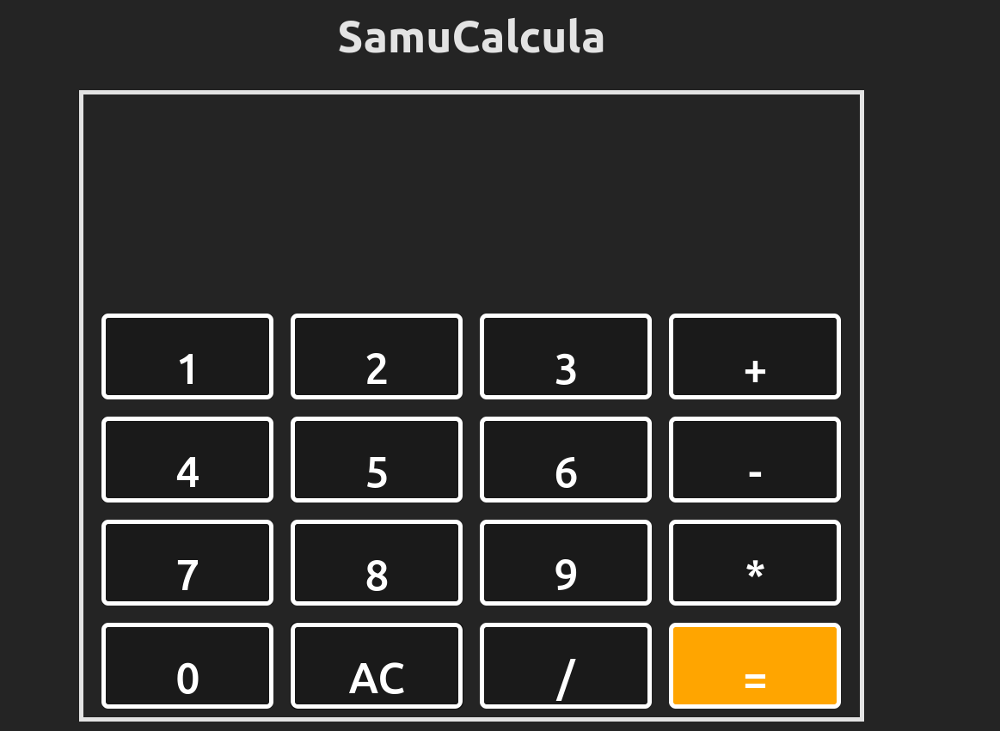

# Calculadora JS

`Desafio 3 do curso de Front end na escola Vai na Web pela instrutora técnica: `
<a href="#" title="defina o titulo do link">
         
        
          <b>Maria Carolina</b>
          [Github](https://github.com/mariaccarolina)
        
      </a>

## Objetivo e Requisitos 🚀

Desenvolver uma Calculadora web simples usando React que seja capaz de realizar operações básicas de matemática e faça uso de styled-components para estilização.

#### Instruções:

---
 1. Operações Matemáticas:
   
    - Sua calculadora deve ser capaz de realizar as seguintes operações: soma, subtração, divisão e multiplicação.
   
    - Ao somar números, garanta que o operador de soma ("+") realize a operação de adição e não a concatenação de strings.
---   
2. Interface de Usuário:
   
    - Implemente botões para cada operação matemática.
   
  --- 
3. Funcionalidades dos Botões:
   
    - Ao clicar em um botão de operação, a operação correspondente deve ser realizada.
   
   - Crie um botão "Limpar" que, quando clicado, limpa o visor e quaisquer entradas anteriores.
   
---
4. Styled-Components:
   
   - Utilize a biblioteca styled-components para estilizar sua calculadora.
   
    - Experimente criar um design atraente e responsivo para dispositivos de diferentes tamanhos.
   
   - Seja criativo! Personalize cores, bordas, sombras e transições para tornar sua calculadora única.
---